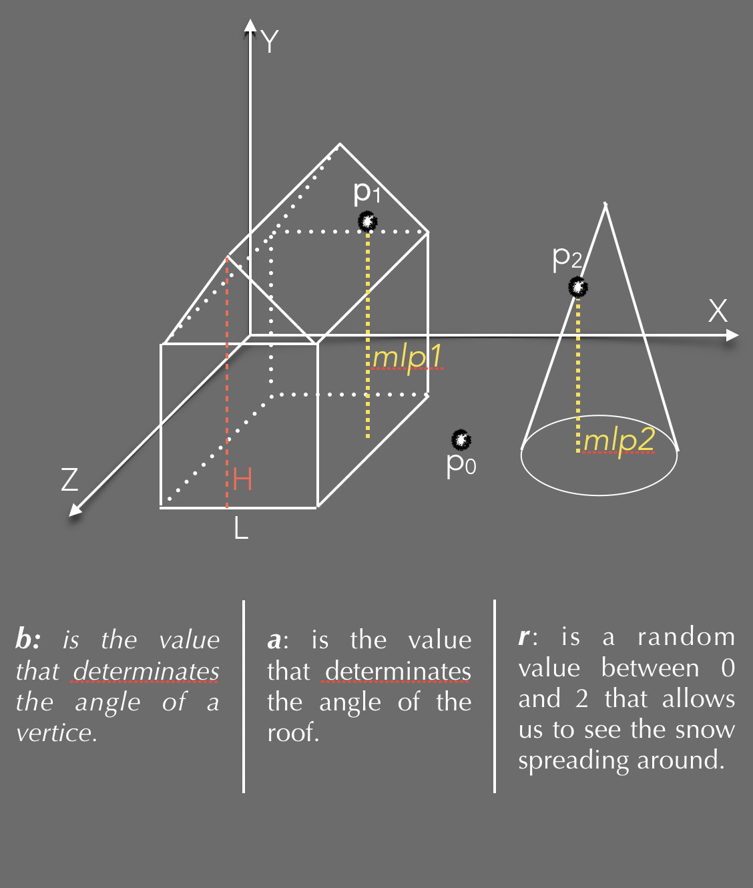

# PARTICLE REPRODUCTION OF SNOWFALL - THREE.js & WebGL
 

### Aims
* Create a particle-system representation of SnowGlobe. 
* Use THREE.js as inteface to WebGL.
* Emphasize use of shaders and technologies studied. 
* Summary study on efficiency of application.

##### A well and examples fully documentation si available here: [Three.js](https://threejs.org)

### Performances
It’s not easy to evaluate performances of a system strongly based on hardware design and software optimization. It’s only possible make some considerations:
* Using a MacBook Pro Retina (2,4 GHz Intel Core i5, Intel Iris 1536 MB) and Safari as reference, were observed results below:
with 50K, 100K or 150K particles, the frame-rate is always 60.
The system has good performances as expected. 

### Introduction 
* A particle-system is a simple representation of a natural phenomena. 
* Our aim is to create a snowfall effect into a snowball.
* The snow will fall only in the ball and it will be cumulative.
* Each particle of snow has its weight, that will determinate the fall’s speed.

### Snow formulation
* All N vertices start from a cylinder over glass sphere.
* Each one has a random value s∈(0,1] and it’s used for two purposes:
  * Size: thickness of particles
  * Speed: magnitude of  velocity V
* Uniform rectilinear motion on y-axis: y'= y - s * t, x = x', z = z'
* Snowfall stops when it touches:
  * The ground
  * The house
  * The tree
* Each particle has an attribute min_level, whose value is based on the coordinates X and Z.
* Three differents values with surfaces:
  * Ground: min_level of p0 is equal to base plan.
  * House: min_level of p1(mlp1) is: H - b *  (Xp1 - L/2 ) - r
  * Tree: min_level of p2(mlp2) is: H - a *  (xp1^2 + zp1^2) - r
  
 

### Performances 
* Using a Macbook pro and Safari as reference:

| Snow Particles  | FPS         |
|:-------------:|:-------------:|
| 50K            | 60fps        |
| 100K           | 60fps        |
| 150K           | 60fps        |     

### Conclusions

An example is reachable at : 
The system can reproduce different scenario, the only difference would be in formulas describing the event

### Developed by [Harjinder Sandhu](https://github.com/harjindersandhu/) and [Leonardo Casini](https://github.com/leonardocasini)

